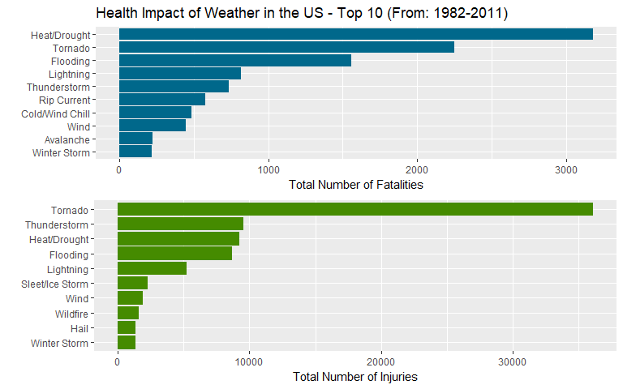
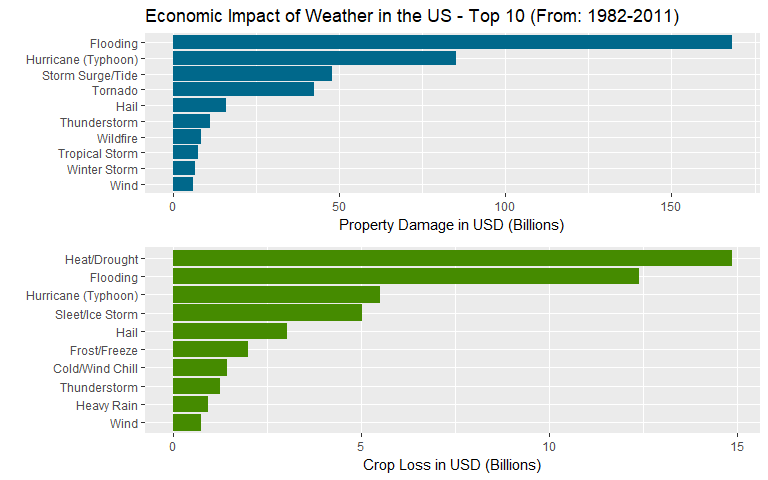

## 1) Synopsis
The U.S. National Oceanic and Atmosphere Administration (NOAA) maintains a public database for storm events. The database tracks characteristics of major storms and weather events in the United States, including when and where they occur, as well as estimates of any fatalities, injuries, property damage and crop damage.

This report shows how the data was processed, manipulated, and analyzed. The analysis focuses on which types of storms are most harmful to the population health resulting in injuries or fatalities, as well as what type of events have the greatest economic consequences which result in property damage or crop loss.

## 2) Data Processing

- The [NOAA Storms Database Codebook](https://d396qusza40orc.cloudfront.net/repdata%2Fpeer2_doc%2Fpd01016005curr.pdf) can be viewed for mores specific on the dataset.
- No preprocessing occurs outside of this document.
- Data processing and analysis was conducted using R (Version 3.43) on RStudio (Version 1.0.44) with Windows 10 x64.

### 2.1) Loading libraries
Necessary libraries to perform loading, manipulations, transformations and plotting.

```r
library(data.table)
library(lubridate)
library(dplyr)
library(ggplot2)
library(grid)
library(gridExtra)
```

### 2.2) Downloading and loading data
If necessary the data is downloaded from the source URL, and read into a data.table from the compressed BZ2 extension to save on local memory.

```r
url <- "https://d396qusza40orc.cloudfront.net/repdata%2Fdata%2FStormData.csv.bz2"
if (!file.exists("StormData.csv.bz2")) {
  download.file(url, destfile = "StormData.csv.bz2") }
if (!exists("storm_data")) {
  storm_data <- read.csv("StormData.csv.bz2")
  storm_data <- as.data.table(storm_data) }
```

### 2.3) Selecting relevant columns
Reducing the size of the `storm_data` by selecting only the following columns and creating a new data.table `red_storm_data`.

- `BGN_DATE` - Start date and time of storm event
- `EVTYPE` - Type of storm event
- `FATALITIES` - Amount of fatalities
- `INJURIES` - Amount of injuries
- `PROPDMG` - Property damage
- `PROPDMGEXP` - Character indicating exponent of `PROPDMG`
- `CROPDMG` - Crop damage
- `CROPDMGEXP` - Character indicating exponent of `CROPDMG`

```r
rel_columns <- c("BGN_DATE", "EVTYPE",
                 "FATALITIES", "INJURIES", "PROPDMG",
                 "PROPDMGEXP","CROPDMG", "CROPDMGEXP")
red_storm_data <- storm_data[,..rel_columns]
```

### 2.4) Creating new variable `year` from `BGN_DATE`
Creating a new variable `year` to  determine the dispersion of observations throughout the years, then splitting the total amount of observations by 10% increments and viewing the year at the split.

```r
red_storm_data$year <- year(as.Date(red_storm_data$BGN_DATE, format = "%m/%d/%Y"))
quantile(red_storm_data$year, probs = seq(0,1,.1))
```

```
##   0%  10%  20%  30%  40%  50%  60%  70%  80%  90% 100% 
## 1950 1982 1992 1996 1999 2002 2004 2006 2008 2010 2011
```

### 2.5) Filtering Storm Data
Since the beginning years account for very few observations the results could be skewed by not removing them. The cutoff point was chosen to be the year 1982, which still uses the majority of the data (~90%), but removes observations that were not being recorded as regularly.

The analysis is solely focused on the health and economic impact of storm events. By filtering the data again and only gathering observations which have a value greater than zero in `INJURIES`, `FATALITIES`, `CROPDMG`, or `PROPDMG` removes any storm events which have no effect.

Finally removing any instances where the `EVTYPE` is unknown.

```r
red_storm_data <- filter(red_storm_data, between(year, 1982, 2011))

red_storm_data <- filter(red_storm_data, INJURIES > 0 | FATALITIES > 0 | PROPDMG > 0 | CROPDMG >0)
red_storm_data <- filter(red_storm_data, EVTYPE != "?", EVTYPE != "Other", EVTYPE != "OTHER")
```

### 2.6) Changing column classes
The column `EVTYPE` is a factor with 985 levels, by changing the columns to 'character' class the events can be seen and manipulated easier and thus reducing the number of unique names. `PROPDMGEXP` AND `CROPDMGEXP` are also changed to 'character' class for easier transformations.

```r
red_storm_data$EVTYPE <- as.character(red_storm_data$EVTYPE)
red_storm_data$PROPDMGEXP <- as.character(red_storm_data$PROPDMGEXP)
red_storm_data$CROPDMGEXP <- as.character(red_storm_data$CROPDMGEXP)
length(unique(red_storm_data$EVTYPE))
```

```
## [1] 485
```

### 2.7) Processing 'EVTYPE'
The 'Storm Data Documentation' section 2.1.1 shows 48 distinct events. Most of the `EVTYPE` names are similar or misspelled from data entry. For example `Wind`, `WIND`, and `WINDS` are all unique names. The following analysis combines all events with similar names to the correct event name. To make sure no major weather types were mismatched, the original list of storm types in the [NOAA Storms Database Codebook](https://d396qusza40orc.cloudfront.net/repdata%2Fpeer2_doc%2Fpd01016005curr.pdf) was referenced to. Instead of 48 distinct events, `EVTYPE` has been combined to 34. The following change is made due to some events not being designated to the distinct 48 storm types and due to changes in how NOAA has categorized the events over the years. Similar events are combined as follows.

- `High Wind`,`Strong Wind`, `Marine High Wind` and `Marine Strong Wind` -> `Wind`

- `Dust Devil` and `Dust Storm` -> `Dust Devil/Dust Storm`

- `Excessive Heat`, `Heat` and `Drought -> `Heat/Drought`

- `Flash Flood`, `Flood`, `Coastal Flood` and `Lakeshore Flood` -> `Flooding`

- `Marine Thunderstorm Wind` and `Thunderstorm Wind` -> `Thunderstorm Wind`

- `Marine Hail` and `Hail` -> `Hail`

- `Cold/Wind Chill` and `Extreme Cold/Wind Chill` -> `Cold/Wind Chill`

- `Lake-Effect Snow` and `Heavy Snow` -> `Heavy Snow`

- `Sleet` and `Ice Storm` -> `Sleet/Ice Storm`


```r
red_storm_data[grepl("ASTRONOMICAL LOW TIDE",
                   red_storm_data$EVTYPE, ignore.case = TRUE), "EVTYPE"] <- "Astronomical Low Tide"

red_storm_data[grepl("AVALANC",
                   red_storm_data$EVTYPE, ignore.case = TRUE), "EVTYPE"] <- "Avalanche"

red_storm_data[grepl("BLIZZARD",
                   red_storm_data$EVTYPE, ignore.case = TRUE), "EVTYPE"] <- "Blizzard"

red_storm_data[grepl("EROSION|ASTRONOMICAL HIGH TIDE|COASTAL FLOOD|HIGH TIDES|FLOOD|DAM BREAK|DROWNING|HIGH WATER|URBAN|RISING",
                     red_storm_data$EVTYPE, ignore.case = TRUE), "EVTYPE"] <- "Flooding"

red_storm_data[grepl("TORN|GUSTNADO",
                     red_storm_data$EVTYPE, ignore.case = TRUE), "EVTYPE"] <- "Tornado"

red_storm_data[grepl("COLD|COOL|HYPOTHERMIA|LOW TEMP|EXTREME WIND[ C]",
                     red_storm_data$EVTYPE, ignore.case = TRUE), "EVTYPE"] <- "Cold/Wind Chill"

red_storm_data[grepl("FREEZING FOG",
                     red_storm_data$EVTYPE, ignore.case = TRUE), "EVTYPE"] <- "Freezing Fog"

red_storm_data[grepl("FOG",
                   red_storm_data$EVTYPE), "EVTYPE"] <- "Dense Fog"

red_storm_data[grepl("DENSE SMOKE",
                   red_storm_data$EVTYPE, ignore.case = TRUE), "EVTYPE"] <- "Dense Smoke"

red_storm_data[grepl("DUST|WHIRL|LANDSPOUT",
                   red_storm_data$EVTYPE, ignore.case = TRUE), "EVTYPE"] <- "Dust Devil/Dust Storm"

red_storm_data[grepl("HEAT|DROUGHT|WARM|HYPER",
                   red_storm_data$EVTYPE, ignore.case = TRUE), "EVTYPE"] <- "Heat/Drought"

red_storm_data[grepl("FIRE",
                   red_storm_data$EVTYPE, ignore.case = TRUE), "EVTYPE"] <- "Wildfire"

red_storm_data[grepl("HURRICANE|TYPHOON",
                   red_storm_data$EVTYPE, ignore.case = TRUE), "EVTYPE"] <- "Hurricane (Typhoon)"

red_storm_data[grepl("TSUNAMI",
                   red_storm_data$EVTYPE, ignore.case = TRUE), "EVTYPE"] <- "Tsunami"

red_storm_data[grepl("WATERSPOUT",
                   red_storm_data$EVTYPE, ignore.case = TRUE), "EVTYPE"] <- "Waterspout"

red_storm_data[grepl("VOLCANIC",
                   red_storm_data$EVTYPE, ignore.case = TRUE), "EVTYPE"] <- "Volcanic Ash"

red_storm_data[grepl("TROPICAL STORM|COASTAL STORM|COASTALSTORM",
                   red_storm_data$EVTYPE, ignore.case = TRUE), "EVTYPE"] <- "Tropical Storm"

red_storm_data[grepl("TROPICAL DEPRESSION",
                   red_storm_data$EVTYPE, ignore.case = TRUE), "EVTYPE"] <- "Tropial Depression"

red_storm_data[grepl("THU|APACHE|^TSTM|^ TSTM|MARINE TSTM|BURST|TUNDERSTORM",
                     red_storm_data$EVTYPE, ignore.case = TRUE), "EVTYPE"] <- "Thunderstorm"

red_storm_data[grepl("HAIL",
                   red_storm_data$EVTYPE, ignore.case = TRUE), "EVTYPE"] <- "Hail"

red_storm_data[grepl("RIP CURRENT",
                     red_storm_data$EVTYPE, ignore.case = TRUE), "EVTYPE"] <- "Rip Current"

red_storm_data[grepl("SURGE",
                     red_storm_data$EVTYPE, ignore.case = TRUE), "EVTYPE"] <- "Storm Surge/Tide"

red_storm_data[grepl("SLIDE|SLUMP",
                     red_storm_data$EVTYPE, ignore.case = TRUE), "EVTYPE"] <- "Debris Flow"

red_storm_data[grepl("FUNNEL CLOUD",
                     red_storm_data$EVTYPE, ignore.case = TRUE), "EVTYPE"] <- "Funnel Cloud" 

red_storm_data[grepl("seiche",
                     red_storm_data$EVTYPE, ignore.case = TRUE), "EVTYPE"] <- "Seiche"

red_storm_data[grepl("HEAVY RAIN|HVY RAIN|HEAVY SHOWER|HEAVY PRECIP|RAINFALL|RAINSTORM|WETNESS|UNSEASONAL RAIN|^RAIN",
                     red_storm_data$EVTYPE, ignore.case = TRUE), "EVTYPE"] <- "Heavy Rain"

red_storm_data[grepl("HEAVY SNOW|BLOWING SNOW|RECORD SNOW|EXCESSIVE SNOW|SQUALL|LAKE([- ])?EFFECT|LAKE|^SNOW$|SNOW ACCUMULATION|SEASON SNOW",
                     red_storm_data$EVTYPE, ignore.case = TRUE), "EVTYPE"] <- "Heavy Snow"

red_storm_data[grepl("HIGH S[EUW]|HEAVY S[EUW]|HIGH WAVES|ROUGH S|HAZARDOUS SURF|MARINE [AM]|ROGUE",
                     red_storm_data$EVTYPE, ignore.case = TRUE), "EVTYPE"] <- "High Surf"

red_storm_data[grepl("LIGHTNING|LIGNTNING|LIGHTING",
                     red_storm_data$EVTYPE, ignore.case = TRUE), "EVTYPE"] <- "Lightning"

red_storm_data[grepl("WINTER STORM",
                     red_storm_data$EVTYPE, ignore.case = TRUE), "EVTYPE"] <- "Winter Storm"

red_storm_data[grepl("HIGH WIND|STRONG WIND|^WIND|WIND$|WINDS$|WIND DAMAGE|TURBULENCE|HIGH$|GUSTY",
                     red_storm_data$EVTYPE, ignore.case = TRUE), "EVTYPE"] <- "Wind"

red_storm_data[grepl("FREEZE|FROST",
                   red_storm_data$EVTYPE, ignore.case = TRUE), "EVTYPE"] <- "Frost/Freeze"

red_storm_data[grepl("SLEET|ICE STORM|FREEZING RAIN|MIX|FREEZING [DS]",
                     red_storm_data$EVTYPE, ignore.case = TRUE), "EVTYPE"] <- "Sleet/Ice Storm"

red_storm_data[grepl("WINTER WEATHER|WINTRY|BLACK ICE|^ICE|ICE$|LIGHT SNOW|ICY ROADS|GLAZE",
                     red_storm_data$EVTYPE, ignore.case = TRUE), "EVTYPE"] <- "Winter Weather"

sort(unique(red_storm_data$EVTYPE))
```

```
##  [1] "Astronomical Low Tide" "Avalanche"            
##  [3] "Blizzard"              "Cold/Wind Chill"      
##  [5] "Debris Flow"           "Dense Fog"            
##  [7] "Dense Smoke"           "Dust Devil/Dust Storm"
##  [9] "Flooding"              "Freezing Fog"         
## [11] "Frost/Freeze"          "Funnel Cloud"         
## [13] "Hail"                  "Heat/Drought"         
## [15] "Heavy Rain"            "Heavy Snow"           
## [17] "High Surf"             "Hurricane (Typhoon)"  
## [19] "Lightning"             "Rip Current"          
## [21] "Seiche"                "Sleet/Ice Storm"      
## [23] "Storm Surge/Tide"      "Thunderstorm"         
## [25] "Tornado"               "Tropial Depression"   
## [27] "Tropical Storm"        "Tsunami"              
## [29] "Volcanic Ash"          "Waterspout"           
## [31] "Wildfire"              "Wind"                 
## [33] "Winter Storm"          "Winter Weather"
```

### 2.8) Processing 'CROPDMGEXP' and 'PROPDMGEXP'
The `CROPDMGEXP` and `PROPDMGEXP` contains either a number, or a letter designating the exponent value for `CROPDMG` and `PROPDMG`. For example, `k` means $10^3$. Creating two new columns with the correct total cost for `CROPDMG` and `PROPDMG`.

```r
get_exp <- function(x) {
    if (x %in% c("m","M"))
        return(6)
    else if (x %in% c("k","K"))
        return(3)
    else if (x %in% c("b","B"))
        return(9)
    else if (x %in% c("h","H"))
        return(2)
    else if (x %in% c("?","-","+",""))
        return(0)
    else
        return(x)
}
red_storm_data$CROPDMGEXP <- as.numeric(mapply(get_exp,red_storm_data$CROPDMGEXP))
red_storm_data$PROPDMGEXP <- as.numeric(mapply(get_exp,red_storm_data$PROPDMGEXP))

red_storm_data <- red_storm_data %>% mutate(crops = CROPDMG *10 ** CROPDMGEXP)
red_storm_data <- red_storm_data %>% mutate(property = PROPDMG *10 ** PROPDMGEXP)
```

## 3) Analysis
The code below utilizes the processed data `red_storm_data` and computes the sum for the fatalities, injuries, crop loss, and property damage then sorts the data into descending order.

```r
fatalities_table <- aggregate(data = red_storm_data, FATALITIES ~ EVTYPE, sum)
fatalities_table <- fatalities_table[order(fatalities_table$FATALITIES, decreasing = TRUE),]

injuries_table <- aggregate(data = red_storm_data, INJURIES ~ EVTYPE, sum)
injuries_table <- injuries_table[order(injuries_table$INJURIES, decreasing = TRUE),]

crop_table <- aggregate(data = red_storm_data, crops ~ EVTYPE, sum)
crop_table <- crop_table[order(crop_table$crops, decreasing = TRUE),]

property_table <- aggregate(data = red_storm_data, property ~ EVTYPE, sum)
property_table <- property_table[order(property_table$property, decreasing = TRUE),]
```

## 4.1) Health impact results
As can be seen in the figure below. The highest cause by weather events for fatalities in the US is `Heat/Drought` with `Tornado` coming in second. While `Tornado` is second in fatalities is comes in first by far for the most number of injuries, with `Thunderstorm` and and `Heat/Drought` in second and third.

```r
plot1 <- ggplot(data=head(fatalities_table,10), aes(x=reorder(EVTYPE, FATALITIES), y=FATALITIES)) +
    geom_bar(fill="deepskyblue4",stat="identity")  + coord_flip() + 
    ylab("Total Number of Fatalities") + xlab("") +
    ggtitle("Health Impact of Weather in the US - Top 10 (From: 1982-2011)") +
    theme(legend.position="none")

plot2 <- ggplot(data=head(injuries_table,10), aes(x=reorder(EVTYPE, INJURIES), y=INJURIES)) +
    geom_bar(fill="chartreuse4",stat="identity")  + coord_flip() + 
    ylab("Total Number of Injuries") + xlab("") +
    theme(legend.position="none")

grid.arrange(plot1, plot2, nrow = 2)
```

<!-- -->

## 4.2) Economic impact results
The figure below depicts the leading causes of property damages and crop loss in USD. The number one cause for property damage is `Flooding` with `Hurricane (Typhoon)` in second. While crop loss doesn't have as much of an economic impact as property damage (~10%) it is still valued in (Billions USD). The leading cause for crop loss was `Heat/Drought` with `Flooding` and `Hurricane (Typhoon)` coming in second and third.

```r
plot3 <- ggplot(data=head(property_table,10), aes(x=reorder(EVTYPE, property), y=property/(1*10^9))) +
    geom_bar(fill="deepskyblue4",stat="identity")  + coord_flip() + 
    ylab("Property Damage in USD (Billions)") + xlab("") +
    ggtitle("Economic Impact of Weather in the US - Top 10 (From: 1982-2011)") +
    theme(legend.position="none")

plot4 <- ggplot(data=head(crop_table,10), aes(x=reorder(EVTYPE, crops), y=crops/(1*10^9))) +
    geom_bar(fill="chartreuse4",stat="identity")  + coord_flip() + 
    ylab("Crop Loss in USD (Billions)") + xlab("") +
    theme(legend.position="none")

grid.arrange(plot3, plot4, nrow = 2)
```

<!-- -->

## 5) Conclusion
The health impact, be it injuries or fatalities, isn't directly correlated to the economic damage weather events cause. While `Heat/Drought` is the leading cause for fatalities and third for injuries it doesn't make the top 10 for property damage. `Heat/Drought` does come in first for crop loss, but it still is only (~10%) of the value for the leading cause in property damage `Flooding` which came third and fourth for fatalities and injuries.
 
 
